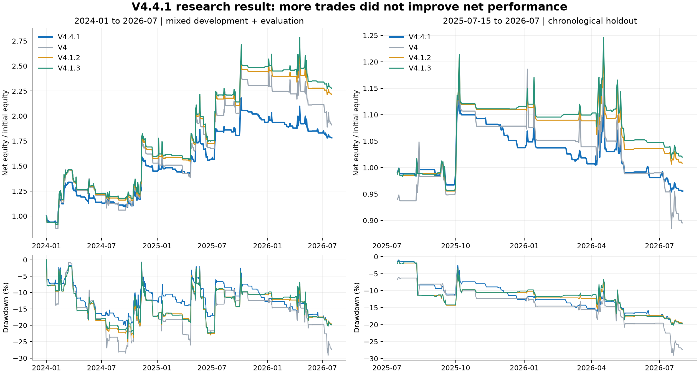

# V4.4.1 策略与研究报告

**结论：研究版未通过目标验收，不替换现有 V4 系列默认配置。**

已经实现近期加权、1h 新入场、主策略优先路由和非对称空头，并完成两阶段共 30 个不同候选的开发期筛选。冻结后的分钟复测显示，交易数增加没有转化为更高净收益和夏普。这里保留失败结果、参数、代码和复现入口，不把候选包装为成功升级。

V4.4.1 在 2024 年后累计净收益 **78.27%**、日收益夏普 **0.875**；在本轮时间留出期累计净收益 **-4.45%**、夏普 **-0.151**。同期 V4.1.2 留出收益 0.84%、夏普 0.150。

## 1. 研究假设与防过拟合设计

美国现货比特币 ETP 于 2024-01-10 获 SEC 批准，见 [SEC 原文](https://www.sec.gov/newsroom/speeches-statements/gensler-statement-spot-bitcoin-011023)。CME 的 [2024 年二季度报告](https://www.cmegroup.com/newsletters/quarterly-cryptocurrencies-report/2024-q3-cryptocurrency-insights.html) 记录了机构持仓参与增加。它们支持研究市场结构变化的必要性，但不足以证明“ETF 导致 V4 失效”。本轮没有引入当日尚未发布的 ETF 流量或任何事后数据。

数据权重用于**参数选择评分**，不修改历史盈亏，也不把某个日期直接写成交易信号：

| 用途 | 实际评分区间（UTC，右端不含） | 权重 |
|---|---|---:|
| 旧制度压力测试 | 2020-01-01 至 2024-01-01 | 20% |
| 近期训练 | 2024-01-15 至 2025-01-01 | 40% |
| 近期验证 | 2025-01-15 至 2025-07-01 | 40% |
| 最终时间留出 | 2025-07-15 至 2026-08-01 | 0% |

各新阶段开头留出 14 天隔离，超过最长计划持仓 12 天。指标可以读取开始前的已知历史；每个评分窗口从 10,000 USDT 独立账户开始，只计算窗口内盈亏。区间末端平仓计成本；不会把跨窗口完整交易的未来盈亏作为训练标签。

评分 = 加权日收益夏普 + 0.25 × 加权年化对数增长 − 0.5 × 两个近期窗口夏普的标准差 − 2 × 三个窗口最差回撤绝对值。训练至少 20 个、验证至少 8 个完整交易周期，开发窗口最大回撤不得超过 45%。近似同分优先关闭空头、再选更慢的趋势周期。

第一阶段预设 24 个组合，仅改变 4h EMA 周期、跟踪距离、入场方式和做空开关。其胜出者没有超过开发期 V4.1.2；**查看留出结果之前**，追加 6 个固定主策略/小时策略路由组合。完整试验、原始冻结文件和追加协议均保留在 `phase1/`、`phase2_protocol.json`、`phase2_candidates.csv`。最终候选为 `phase2_c01`，冻结时间 `2026-09-20T20:03:00.438276+00:00`。

20/40/40 权重与 60/20/20 的旧数据偏重对照在两个阶段均选中了相同候选。因此，本轮没有证据把任何变化归因于“调高近期权重”本身。2025–2026 年行情此前已被仓库其他研究查看过；本报告的留出只是**本轮选参的时间留出**，不是从未见过的盲测。

## 2. 最终候选的具体交易规则

**单账户主策略优先。** 4h V4.1.2 作为主策略，保留 EMA(30/120)、ADX(26/18) 滞回、波动冲击、资金费拥挤、下行方差分配和 15%/7.5% 回撤刹车。其目标仓位乘 **0.75**，账户目标杠杆上限 **3 倍**。保留 2.5 ATR 初始止损、3 ATR 跟踪止损、12 ATR 止盈和快速下跌退出。主策略的完整冻结参数由 `core_params()` 给出，测试保证其等同于 V4.1.2 配置。

**主策略空仓时寻找新的 1h 入场。** 小时策略的高周期特征严格等到 4h 收盘才可见。4h EMA(12)>EMA(48)、慢线斜率向上、+DI≥−DI、ADX≥18 时允许多头。触发为 1h 收盘突破前 24 小时最高价、上穿 EMA(20)，或刚进入多头状态；要求 RSI<78 且价格距 4h 快线不足 3 ATR，避免追涨过度。

小时策略基础仓位为三者最小值：3 倍、90%/168h EWMA 年化波动率、5%/(2.5×4h ATR/价格)。资金费高于 0.02% 时减半；最终再乘 **0.25**，因此小时策略最高 **0.75 倍**，初始计划止损风险至多约 **1.25%** 权益。90% 是乘数前的波动率参数，不是合并账户承诺达到的波动率。

初始止损 2.5×4h ATR，跟踪止损 3×4h ATR，只向盈利方向移动；趋势失效、波动冲击或最长 240 小时后退出。退出冷却 6 小时，每 24 小时检查仓位，变动不足 25% 不调仓。主策略接管后，旧小时信号作废；主策略再次释放账户时，必须出现新的小时入场事件。两套策略不叠加仓位，不复制保证金。

**谨慎空头已实现，但最终默认关闭。** 空头同时要求 4h 快线在慢线下方、慢线下降、−DI>+DI、ADX≥24，以及已完成日线收盘<EMA(90)、EMA(20)<EMA(90)、慢线斜率向下。只在新的 24h 破位或 EMA(20) 反弹失败时入场，并排除 RSI≤22、过远追跌、波动冲击和拥挤负资金费。小时引擎空头原始上限 0.6 倍、风险预算 1.25%，经 0.25 配置缩放后最高 0.15 倍；止损 1.8 ATR、跟踪 2 ATR、止盈 4 ATR、最长 48 小时。

启用门槛为：近期开发期至少 8 个完整空头周期、合计标准化交易收益为正，且配对验证收益与夏普均不得下降。首阶段全部 12 组多空配对均未过门槛。留出中的“加谨慎空头”仅作固定规则反事实，不能据此重新优化空头。

## 3. 同成本的分钟执行结果

信号在完成 K 线后才允许成交：小时策略下一小时、旧版下一 4h 边界。使用 1m 合约成交价和标记价、真实资金费事件、0.001 BTC 数量取整、每分钟 2% 参与率限制、保证金档位及分钟强平检查。所有策略统一采用 **Taker 4 bps、无返佣、基础滑点 1 bps、冲击 8 bps×sqrt(参与率)**，保护退出按不利跳空成交；没有用 maker 优惠改善新版本。保护退出沿用现有引擎的紧急整笔成交加冲击近似，不模拟订单簿队列。

原始归档未改写。已核验 SHA256 的官方日归档仅补缺失标记价。2020–2026-07 的配对分钟覆盖 3,461,705/3,461,760，剩余 55 个缺口不插值；其中 2024 年后有 2 个分钟缺口。数据到 2026-07-31，未覆盖之后行情。历史保证金档位是模型假设。全部 18 个案例强平次数均为 0。

### 2024-01-01 至 2026-07-31：含开发期的描述性对照

| 策略 | 累计净收益 | CAGR | 日收益夏普 | 最大回撤¹ | 完整交易周期 |
|---|---:|---:|---:|---:|---:|
| V4.4.1 | 78.27% | 25.10% | 0.875 | -21.02% | 126 |
| V4 | 91.07% | 28.50% | 0.775 | -29.17% | 96 |
| V4.1.2 | 121.71% | 36.12% | 0.954 | -25.03% | 96 |
| V4.1.3 | 127.74% | 37.54% | 0.979 | -24.15% | 130 |
| 仅主策略（同等降仓） | 82.62% | 26.27% | 0.919 | -19.35% | 96 |
| 加谨慎空头 | 75.72% | 24.40% | 0.856 | -21.26% | 222 |
| 仅 1h 趋势策略 | 7.36% | 2.79% | 0.260 | -48.34% | 101 |

### 2025-07-15 至 2026-07-31：冻结后的时间留出

| 策略 | 累计净收益 | CAGR | 日收益夏普 | 最大回撤¹ | 完整交易周期 |
|---|---:|---:|---:|---:|---:|
| V4.4.1 | -4.45% | -4.25% | -0.151 | -19.86% | 41 |
| V4 | -10.47% | -10.03% | -0.206 | -29.06% | 33 |
| V4.1.2 | 0.84% | 0.81% | 0.150 | -19.99% | 28 |
| V4.1.3 | 1.99% | 1.90% | 0.197 | -20.20% | 44 |
| 仅主策略（同等降仓） | 0.42% | 0.40% | 0.109 | -15.21% | 28 |
| 加谨慎空头 | -4.52% | -4.32% | -0.153 | -19.75% | 109 |
| 仅 1h 趋势策略 | -36.81% | -35.52% | -1.150 | -48.26% | 37 |

¹ 最大回撤按分钟执行后保存的**每小时末权益**计算；不是逐分钟盘中最大回撤。夏普由 UTC 日权益收益计算，年化因子 sqrt(365.25)，无风险利率按零。交易数指从零仓位到平仓的实际完整周期，不是挂单、填单或调仓笔数。源策略切换可能发生在同一完整周期内，因此 `attribution` 只按入场来源分组，不能用其中 PnL 充当独立策略贡献。

V4.4.1 相对 V4.1.2 的交易数由 96 增至 126（+31.25%），留出由 28 增至 41（+46.43%）；但相对已包含 V8 的 V4.1.3，并未增加总交易数。相同降仓条件的“仅主策略”在全后段和留出都优于加入小时策略的版本，说明新增小时交易没有证明净增益。较低回撤主要伴随着主策略降仓，不能归功于更高频率。



### 分年拆解

| 策略 | 年度 | 累计收益 | 夏普 | 最大回撤¹ |
|---|---|---:|---:|---:|
| V4.4.1 | 2024 | 44.89% | 1.179 | -21.02% |
| V4.4.1 | 2025 | 33.70% | 1.121 | -17.39% |
| V4.4.1 | 2026（1–7月） | -7.97% | -0.662 | -16.59% |
| V4.1.2 | 2024 | 57.35% | 1.160 | -25.03% |
| V4.1.2 | 2025 | 55.24% | 1.309 | -22.96% |
| V4.1.2 | 2026（1–7月） | -9.23% | -0.565 | -20.06% |
| V4.1.3 | 2024 | 60.08% | 1.195 | -24.15% |
| V4.1.3 | 2025 | 55.88% | 1.320 | -22.55% |
| V4.1.3 | 2026（1–7月） | -8.73% | -0.525 | -20.28% |

### 留出压力测试

费用压力设为单边 Taker 8 bps、基础滑点 3 bps、冲击 16 bps×sqrt(参与率)：

| 策略 | 累计净收益 | CAGR | 日收益夏普 | 最大回撤¹ | 完整交易周期 |
|---|---:|---:|---:|---:|---:|
| V4.4.1 | -9.93% | -9.51% | -0.456 | -22.69% | 41 |
| V4.1.2 | -6.17% | -5.91% | -0.144 | -22.30% | 28 |

另外将全部信号及保护价更新统一延迟 1 小时：

| 策略 | 累计净收益 | CAGR | 日收益夏普 | 最大回撤¹ | 完整交易周期 |
|---|---:|---:|---:|---:|---:|
| V4.4.1 | -4.36% | -4.17% | -0.148 | -19.30% | 41 |
| V4.1.2 | 0.02% | 0.02% | 0.116 | -18.67% | 28 |

延迟压力测试表示信号/保护更新整体滞后一小时，并不等价于交易所网络故障期间所有止损无法执行。无额外优化成本或延迟参数。

## 4. 统计解释与验收

对配对日收益执行 14 天连续区块重抽样，固定随机种子 441，共 2,000 次，以保留一部分收益自相关。V4.4.1 相对 V4.1.2 的留出夏普差 95% 区间为 **[-0.984, 0.124]**。它不支持宣称稳定提升；这些区间也是选模后的条件描述，不是经过多重试验校正的显著性检验。

增加交易周期不能创造新的牛熊环境，1h 交易仍共享相同 BTC 风险。近期加权有合理动机，空头也可作为研究模块，但这批结果否定了“仅靠缩周期、加次数和此套谨慎空头就能提升表现”的具体实现。

**验收状态：未达到“2024 年后更高夏普且更高收益”的目标。** 参数和代码保留供复现，现有默认策略不变。任何后续更换因子或参数都应标为新的研究轮次，并把本轮留出视为已经看过的数据；需要新的未来数据或独立前向纸面验证才能再次给出未见样本结论。本任务没有下单或修改交易账户。

## 5. 文件与复现

- `configs/v4_4_1_params.json`：冻结候选参数（研究版）。
- `src/btc_regime/v441.py`：信号、风险和路由。
- `protocol.json`、`phase1/`、`phase2_protocol.json`：全部研究路径与原始冻结记录。
- `final_selection_lock.json`：最终参数、源代码/候选表哈希、冻结时间。
- `report.json`、`summary.csv`：机器可核查结果；每个案例目录含权益、填单、完整交易和资金费。
- `data_audit.json`：数据来源、逐月覆盖和修补校验。
- `tests/test_v441.py`：多周期因果、资金费零值、延迟执行、跳空、止损后同周期锁定、路由与参数限制。

```bash
# 首次准备数据；只补缺口，不覆盖原始归档
PYTHONPATH=src python3 scripts/prepare_v441_data.py --repair

# 两阶段选参的历史流程；禁止据留出结果改候选后覆盖冻结文件
PYTHONPATH=src python3 scripts/research_v441.py --phase2

# 冻结参数的正式分钟复测与图表
PYTHONPATH=src python3 scripts/evaluate_v441.py --workers 2
PYTHONPATH=src python3 scripts/render_v441_report.py
PYTHONPATH=src python3 -m pytest -q
```

第一阶段原始候选表与代码哈希已归档。`--phase2` 会从归档的第一阶段赢家重算七个配置（六个新增、一个原候选对照），只在与冻结表一致时复用锁。正式评估会拒绝与最终源代码哈希或参数不一致的运行。图表需要项目依赖 Matplotlib。
