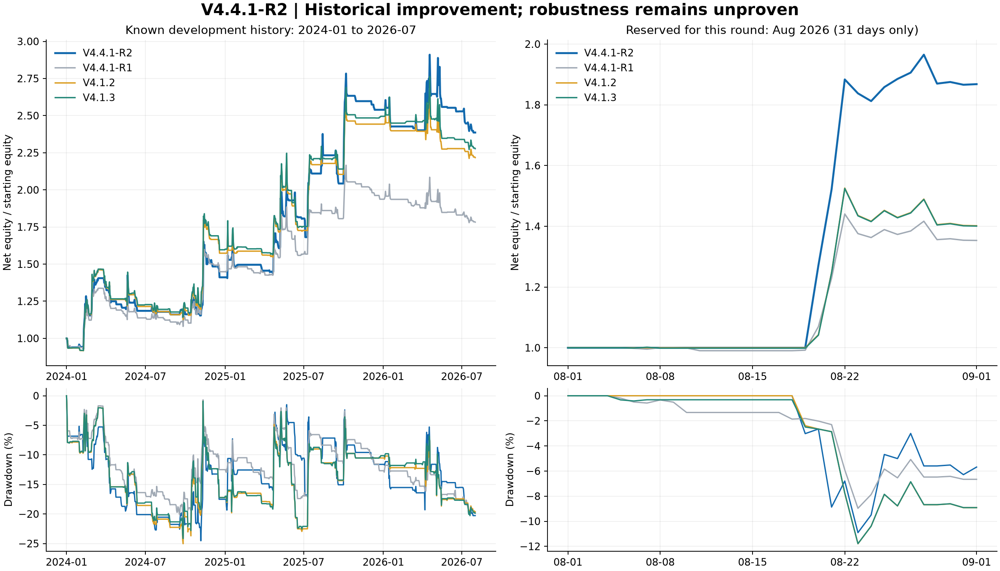

# V4.4.1-R2：中速识别与趋势恢复入场

**已取得已知历史上的收益、夏普改善；稳健升级尚未通过，不替换默认策略。**

2024-01-01 至 2026-07-31，冻结方案净收益 **138.61%**，CAGR **40.05%**，日收益夏普 **1.012**。相较 R1 的 78.27% / 0.875 明显改善，相较 V4.1.3 的 127.74% / 0.979 是小幅改善。成本及延迟压力下优势消失，逐期选参也未超过基准。完整保留 132 个参数配置试验、六个分钟候选及未通过的方案。

## 具体策略

1. **4h 中速核心**：EMA(20/80)，ADX(14) 24 进入 / 17 退出的滞回；保留原核心的 DI 方向、均线间距条件以及非趋势超跌反弹。只有原始核心目标为多头，小时入场才可能启动。没有强加日线方向过滤。
2. **新事件入场**：核心刚从空仓变为做多，或小时收盘重新站上 EMA(20)，或小时收盘突破此前 6 小时最高价。4h 特征等到完整收盘后才可见；小时收盘发信号，下一小时起执行。
3. **保护和恢复**：以已完成 4h ATR(20) 设置 3 ATR 初始止损；最高小时收盘价减 3 ATR 跟踪，止损只收紧。取消原 12 ATR 固定止盈和 V4.1.2 的专用快速下跌保护层；仍保留原始核心的风险减仓。分钟标记价触发保护后平仓；小时逻辑用已经发生的标记低价确认退出。退出后冷却 6 小时，且需要新事件才能再次入场；最长 72 小时，原始核心变为空仓也退出。不是同一个旧信号被止损后不断重开。
4. **仓位**：继承原核心 ATR 波动率目标 107.5%、趋势乘数 1.25、反弹乘数 0.65，以及波动冲击、资金费拥挤、下行波动和价格回撤风险层。下单目标上限 4 倍；本段实际观察峰值为 4.14 倍，权益变化会使盘中实际杠杆暂时高于目标。原核心 60 根 4h 常规调仓和风险变化即时减仓规则不变。
5. **默认关闭空头**：测试的谨慎空头没有形成可靠净增益。与主策略路由组合时仅接受新周期，单账户不叠加保证金；最终候选不包含此组合。

参数文件 `configs/v4_4_1_round2_params.json` 中 `target_vol=0.9`、`entry=15` 是统一候选结构留存的战术族字段，**本 continuation 候选不使用**；其实际目标波动率由 `core_params()` 的 1.075 给出。`hold_hours=72`、`stop_atr=3`、`speed=medium`、`protection=original`（3 ATR 跟踪）和 `max_leverage=4` 才是本族有效差异。配置不应直接传给旧版 CLI 的 `StrategyParams`。

## 数据权重与选择

旧数据 2020–2023 权重 **15%**；2024–2026-07 五个连续时间段合计 **85%**，每段 17%。按时间段平均，避免较长旧历史淹没新环境。效用 = 日收益夏普 + 0.5×年化对数增长 − 2×最大回撤绝对值；总分再扣近期各段夏普标准差的 0.3 倍。最近全段回撤不得超过 35%，旧段不得超过 55%，近期至少 30 个完整交易周期。

先注册 72 个核心、16 个回撤买入、8 个突破多空配置，再把入选核心和战术方案做 12 个固定小仓位路由组合；观察到旧周期止损锁定后，查看保留月之前追加注册 24 个恢复入场配置。共 **132 次配置试验（含经济行为可能相同的组合）**。小时低成本筛选后，六个候选统一在 2020–2023 和 2024–2026-07 做完整分钟验证，按同一评分冻结 `r110`，没有按 8 月结果改参数。

权重敏感性只作诊断：六个分钟候选中，旧数据权重 15% 选 r110；40% 选 r000；60% 选 r000。它不能独立证明 ETF 引发收益结构变化。SEC 于 2024-01-10 批准现货比特币 ETP，见 [SEC 公告](https://www.sec.gov/newsroom/speeches-statements/gensler-statement-spot-bitcoin-011023)；将该时间点视为研究分界是一项假设，未使用 ETF 净流入或其他宏观因子来做因果识别。

**样本披露**：2026 年 7 月及以前已经在第一轮及其他研究中看过，本轮全部属于已知开发历史，不能重新宣称盲测。2026 年 8 月在本轮仅先检查覆盖和文件哈希，冻结后才计算策略收益；仓库其他研究可能已经看过，因此只是本轮保留月。没有使用不完整的 9 月。

## 同成本分钟回测

所有账户从 10,000 USDT 起步，计入 4 bps Taker、无返佣、基础滑点 1 bps、8 bps×sqrt(参与率) 冲击、实际资金费、0.001 BTC 取整、每分钟 2% 常规成交参与率及保证金检查。紧急保护退出沿用原引擎整笔成交加冲击近似，不是订单簿重放。历史保证金档位为模型假设。各评估窗口独立账户，指标和策略状态用此前历史预热；末端强制平仓并计费。

夏普统一使用 UTC **日收益**、sqrt(365.25)、零无风险利率；`execution_metrics.sharpe` 是引擎小时统计，不用于本报告排名。最大回撤来自每小时保存权益，不是分钟内最坏权益。交易数为从零仓位至平仓的完整周期。

### 2024-01-01 至 2026-07-31（已知开发历史）

| 策略 | 累计净收益 | CAGR | 日收益夏普 | 最大回撤 | 完整交易周期 |
|---|---:|---:|---:|---:|---:|
| V4.4.1-R2 | 138.61% | 40.05% | 1.012 | -24.53% | 130 |
| V4.4.1-R1 | 78.27% | 25.10% | 0.875 | -21.02% | 126 |
| V4.1.2 | 121.71% | 36.12% | 0.954 | -25.03% | 96 |
| V4.1.3 | 127.74% | 37.54% | 0.979 | -24.15% | 130 |
| V4 | 91.07% | 28.50% | 0.775 | -29.17% | 96 |

R1 上限为 3 倍，R2 上限为 4 倍，R2 相比 R1 的改善不能全部归因于信号结构。与 6.5 倍上限的 V4.1.3 比较，R2 收益高 10.88 个百分点、夏普仅高 0.032，最大回撤反而多约 0.39 个百分点。

### 同为 4 倍上限的结构对照

| 策略 | 累计净收益 | CAGR | 日收益夏普 | 最大回撤 | 完整交易周期 |
|---|---:|---:|---:|---:|---:|
| 原速度核心、4 倍上限 | 111.20% | 33.59% | 0.911 | -25.03% | 96 |
| 中速核心、原保护规则 | 139.01% | 40.14% | 0.987 | -23.53% | 100 |
| V4.4.1-R2 | 138.61% | 40.05% | 1.012 | -24.53% | 130 |
| R2：初始止损 2 ATR | 137.18% | 39.73% | 1.009 | -27.42% | 132 |
| 中速核心＋小仓位突破多空 | 137.15% | 39.72% | 0.978 | -24.30% | 138 |

原速度换为中速核心的增益较明显。恢复入场把完整周期从 100 提高到 130，夏普从约 0.987 提高到 1.012，但收益略低于中速原保护核心，不能称为收益全面支配。相对 V4.1.2 的 96 个周期增加约 35%；相对 V4.1.3 的 130 个周期没有增加。最终方案的持仓中位数约 47 小时，属于中低频交易。

短线回撤买入 16 个配置在扣费后全部亏损；额外 500 左右交易没有制造有效独立样本。中速核心加 25% 战术突破多空后，收益和夏普略降。减少风险保护、单纯缩紧止损或更快均线也未在加权评分中胜出。它们保留在 `screen.csv`，不隐藏失败结果。

### 分段检查（同一账户连续运行后的切片）

| 分段（UTC，右端不含） | R2 收益 | R2 夏普 | R2 最大回撤 |
|---|---:|---:|---:|
| 2024-01-01 → 2024-07-01 | 18.53% | 0.944 | -20.11% |
| 2024-07-01 → 2025-01-01 | 19.04% | 0.975 | -17.51% |
| 2025-01-01 → 2025-07-01 | 28.08% | 1.338 | -15.39% |
| 2025-07-01 → 2026-01-01 | 40.52% | 1.879 | -15.06% |
| 2026-01-01 → 2026-08-01 | -6.03% | -0.222 | -20.27% |

2026 年 1–7 月仍亏损，尚未解决所有近期环境。以下较晚子段重新从现金开始，日期对应 R1 的旧留出，但它已参与本轮开发：

| 策略 | 累计净收益 | CAGR | 日收益夏普 | 最大回撤 | 完整交易周期 |
|---|---:|---:|---:|---:|---:|
| V4.4.1-R2 | 11.69% | 11.15% | 0.496 | -20.17% | 44 |
| V4.4.1-R1 | -4.45% | -4.25% | -0.151 | -19.86% | 41 |
| V4.1.2 | 0.84% | 0.81% | 0.150 | -19.99% | 28 |
| V4.1.3 | 1.99% | 1.90% | 0.197 | -20.20% | 44 |

### 冻结后开启：2026 年 8 月

| 策略 | 月度净收益 | 最大回撤 | 完整交易周期 |
|---|---:|---:|---:|
| V4.4.1-R2 | 86.80% | -10.91% | 5 |
| V4.4.1-R1 | 35.34% | -8.97% | 4 |
| V4.1.2 | 40.18% | -11.79% | 3 |
| V4.1.3 | 40.07% | -11.79% | 4 |

完整 44,640 个配对分钟。仅 31 天、R2 5 个交易周期，8 月 19–22 日单笔交易净赚约 8,800 USDT，超过全月净利润约 8,680 USDT；月度优势高度集中于一段上涨。不强调这一短窗口的年化夏普，也不将其外推为长期收益。新月份没有继续参与选参。原始成交价与标记价归档未改动；此前 2024 年后仍有 2 个缺失配对分钟，未插值。报告中 37 个新旧案例均未发生模型强平，这不代表不存在实际强平风险。



## 时间顺序验证和压力检查

在四个边界，仅用该边界以前的收益在 120 个独立配置中选参（排除利用全开发期选出的路由）。下期前 14 天保持现金，超过各配置最长计划持仓 12 天；实际分钟回测从现金开始，扣除进入和末端退出成本。候选族的研究设计本身看过完整历史，因此这是**回顾性的顺序验证**，不是从未见过的数据实验。

| 下一期评估（UTC，右端不含） | 仅按此前收益选中 | 组合净收益 | 组合夏普 | V4.1.3 净收益 | V4.1.3 夏普 |
|---|---|---:|---:|---:|---:|
| 2024-07-15 → 2025-01-01 | r050 | 27.56% | 1.593 | 30.55% | 1.435 |
| 2025-01-15 → 2025-07-01 | r026 | -16.03% | -1.424 | 8.24% | 0.595 |
| 2025-07-15 → 2026-01-01 | r110 | 18.60% | 1.311 | 11.58% | 1.199 |
| 2026-01-15 → 2026-08-01 | r110 | -9.04% | -0.440 | -13.34% | -0.985 |

四段收益顺序相乘并将边界隔离期计为现金，选参组合净收益 **15.54%**、夏普 **0.381**；同窗口 V4.1.3 净收益 **36.65%**、夏普 **0.604**。不能用最后胜出的 r110 反填早期选择。这项验证没有证明选参流程稳定优于旧版。

费用压力：Taker 8 bps、基础滑点 3 bps、冲击系数 16 bps；整个 2024–2026-07 窗口重新成交：

| 策略 | 累计净收益 | CAGR | 日收益夏普 | 最大回撤 | 完整交易周期 |
|---|---:|---:|---:|---:|---:|
| V4.4.1-R2 | 72.86% | 23.61% | 0.709 | -31.17% | 130 |
| V4.1.3 | 75.73% | 24.40% | 0.731 | -28.34% | 130 |

将目标与保护更新统一延迟 1 小时：

| 策略 | 累计净收益 | CAGR | 日收益夏普 | 最大回撤 | 完整交易周期 |
|---|---:|---:|---:|---:|---:|
| V4.4.1-R2 | 95.08% | 29.54% | 0.838 | -25.68% | 130 |
| V4.1.3 | 99.00% | 30.54% | 0.857 | -25.74% | 130 |

两类压力下 R2 都落后于 V4.1.3，说明基础条件下的小优势容易被执行成本侵蚀。延迟压力保留已经生效的止损，不等价于交易所完全断连。

14 天配对连续区块重抽样 2,000 次，R2 相对 V4.1.3 的夏普差 95% 区间 **[-0.409, 0.527]**，包含零。它是选参后的条件区间，未修正 132 次试验，不能作为显著性证明。反复尝试会增加回测过拟合风险，相关方法论见 [Bailey 等原始论文](https://www.davidhbailey.com/dhbpapers/backtest-prob.pdf)。交易数量增加不能创造新的独立市场环境。

## 交付和复现

状态为 **历史改善、稳健性待证**。R2 保留为当前 V4.4.1 的改进候选；R1 的代码、配置和冻结记录完整保留。仓库处于 `main`，未替换默认配置，也未连接交易账户下单。

- `configs/v4_4_1_round2_params.json`：冻结参数；`src/btc_regime/v441_r2.py`：信号实现。
- `protocol.json`、`continuation_protocol.json`、`screen.json/csv`：全部候选与研究过程。
- `minute_selection.json`：六个候选的真实分钟评分；`final_selection_lock.json`：参数、代码、输入和候选哈希。
- `report.json`、`summary.csv`：结构化结果；每个案例目录有权益、填单、资金费、交易和强平记录。
- `rolling_choices.json` 和 `rolling_*_equity.csv`：真实逐期选择及现金隔离期权益。
- `tests/test_v441_r2.py`：各策略族前缀因果、仓位限制、止损单向收紧、标记价触发、冷却、新事件入场和路由。

```bash
# 冻结版本审计；要求已有 data/v441 原始研究缓存。
PYTHONPATH=src python3 scripts/prepare_v441_round2_extension.py
PYTHONPATH=src python3 scripts/evaluate_v441_round2.py audit
PYTHONPATH=src python3 scripts/evaluate_v441_round2.py rolling
PYTHONPATH=src python3 scripts/render_v441_round2_report.py
PYTHONPATH=src python3 -m pytest -q
```

绘图需要 Matplotlib。开发筛选入口 `scripts/research_v441_round2.py`、`--continuation` 及 `evaluate_v441_round2.py development` 在存在最终锁时拒绝覆盖；研究记录已输出，不需要解锁来复测。`screen_manifest.json` 是首批 108 次小时试验的历史快照，最终审计以 `final_selection_lock.json` 为准。下一轮应保留本轮结论，并将截至 2026-08 的数据全部视为已知历史。
