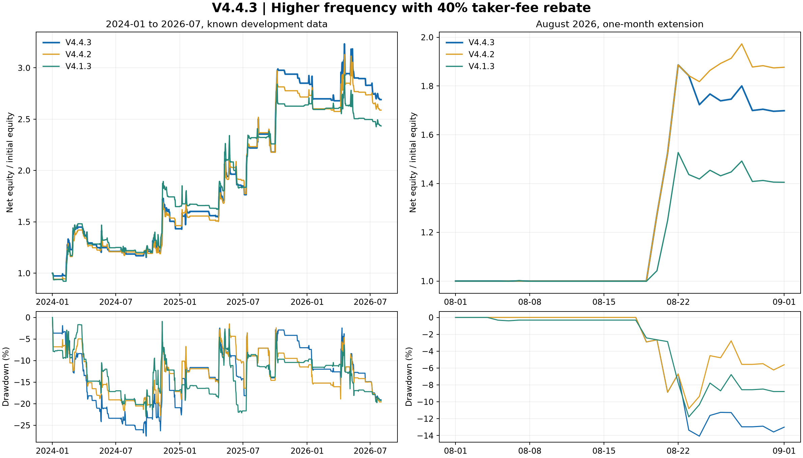

# V4.4.3：返佣与适度提频优化

**V4.4.3 已冻结为研究候选；不自动替换默认策略。**

本轮先将原 V4.4.1-R2 正式更名为 **V4.4.2**，再固定采用 40% Taker 返佣：公布费率 4 bps、返佣 40%，回测中的有效费率为 **2.4 bps**。V4.4.3 在此成本假设下增加小时级趋势恢复、EMA 重夺和短周期突破入场，并测试 162 组止损、跟踪、持仓和入场组合。

2024-01-01 至 2026-07-31 的 1 分钟成交回测结果：

| 策略 | 累计净收益 | CAGR | 日收益夏普 | 最大回撤 | 完整周期 |
|---|---:|---:|---:|---:|---:|
| V4.4.3 | 169.09% | 46.73% | 1.127 | -27.51% | 145 |
| V4.4.2 | 158.84% | 44.54% | 1.088 | -22.75% | 130 |
| V4.1.3 | 143.37% | 41.13% | 1.043 | -23.00% | 130 |

V4.4.3 比返佣后的 V4.4.2 多约 **10.2 个百分点**净收益，夏普高 **0.040**，完整周期由 130 增至 145；最大回撤增加约 4.8 个百分点。与 V4.1.3 相比，净收益多约 25.7 个百分点，夏普高 0.085。

## 冻结规则

- 4h EMA(20/80) 和 ADX(24/17) 作为趋势锚点；目标杠杆上限 4 倍，风险层沿用 V4.4.2 的波动冲击、资金费拥挤、下行风险和回撤控制。
- 在主趋势仍为多头时，小时收盘可以触发三类新事件：核心刚重新变为多头、价格重新站上 EMA(20)、或突破此前 6 小时高点。
- 初始止损为 **1.5 ATR(4h)**，跟踪止损为 **3 ATR(4h)**，最长持仓 72 小时，保护退出后冷却 3 小时。止损仅向盈利方向收紧，必须出现新事件才可重新入场。
- 只做多。下跌趋势空仓；此前测试的谨慎空头没有在统一成本下提供稳定增益。
- 1 分钟成交模型使用 4 bps Taker、40% 返佣、1 bps 基础滑点、8 bps×sqrt(参与率) 冲击、真实资金费、0.001 BTC 取整和 2%/分钟参与率上限。返佣不适用于滑点、资金费或强平费用。

配置见 [`configs/v4_4_3_params.json`](../../configs/v4_4_3_params.json)，V4.4.2 配置见 [`configs/v4_4_2_params.json`](../../configs/v4_4_2_params.json)。

## 频率和防过拟合

V4.4.3 注册了 162 组配置：中速/快速 EMA、1.5/2/3 ATR 初始止损、1.5/2.5/3 ATR 跟踪止损、24/48/72 小时最长持仓、三种小时入场模式。旧数据权重 15%，2024 年后五个时间段合计 85%；近期最大回撤不超过 35%，旧段不超过 55%，近期至少 30 个周期。代理筛选后取 8 个候选做完整分钟复测，再冻结 `r024`。

交易频率从 V4.4.2 的 130 个完整周期提高到 145 个，增幅约 11.5%。没有采用 24 小时持仓的最高频配置，因为它的交易次数虽接近 300 次，分钟夏普和收益均较低。提频没有被当成独立样本数量；所有候选仍共享 BTC 的相同市场环境。

## 结果边界

2026 年 8 月在冻结之后才开启评估，完整配对分钟 44,640 个，但 V4.4.3 仅有 6 个周期：

| 策略 | 8 月收益 | 夏普 | 最大回撤 | 周期 |
|---|---:|---:|---:|---:|
| V4.4.3 | 69.87% | 5.013 | -14.07% | 6 |
| V4.4.2 | 87.69% | 5.974 | -10.81% | 5 |
| V4.1.3 | 40.51% | 4.215 | -11.78% | 4 |

8 月 V4.4.3 落后于 V4.4.2；样本太短，不据此调参或宣称长期结论。2025-07-15 至 2026-07-31 的已知后段，V4.4.3 收益 19.86%、夏普 0.737，V4.4.2 为 14.69% / 0.580。

将 Taker、滑点和冲击全部加倍后，2024-01 至 2026-07 的结果为：V4.4.3 108.41% / 0.886，V4.4.2 103.16% / 0.861，V4.1.3 100.52% / 0.857。V4.4.3仍领先，但优势缩小。

14 天配对区块 bootstrap（2,000 次）中，V4.4.3 相对 V4.4.2 的夏普差 95% 区间为 [-0.225, 0.331]；相对 V4.1.3 为 [-0.375, 0.622]。区间包含零，且未对 162 次试验做多重检验校正。



**状态：历史样本在返佣假设下有改善，稳健性仍待未来数据确认。** 截至 2026-08 的数据均应视为已知；该策略没有连接交易账户，也没有执行实盘下单。若实际返佣不是稳定的 40%，应将有效费率改回账户真实费率后重新评估。

复现：

```bash
PYTHONPATH=src:scripts python3 scripts/research_v443.py screen --workers 3
PYTHONPATH=src:scripts python3 scripts/research_v443.py minute --workers 3
PYTHONPATH=src:scripts python3 scripts/research_v443.py freeze
PYTHONPATH=src:scripts python3 scripts/evaluate_v443.py
PYTHONPATH=src:scripts python3 scripts/render_v443_report.py
PYTHONPATH=src python3 -m pytest -q
```
