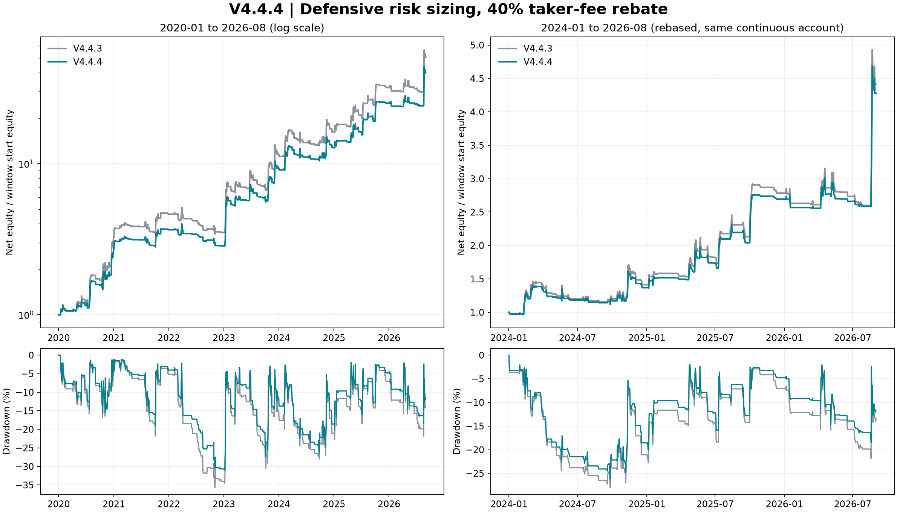

# V4.4.4：全量回测后的防御型风险调节

V4.4.4 已冻结为 **`r025`**。相对 V4.4.3，全样本和 2024 年后日收益夏普均提高，回撤降低；累计收益有所下降。因此本版实现的是用户本轮优先目标——提高整体、尤其近期夏普，尚未实现收益与夏普同时提高。

## 统一口径的结果

本轮从 **2020-01-01 00:00 UTC 到 2026-09-01 00:00 UTC（不含）**运行连续账户，覆盖至本地完整缓存的 2026 年 8 月末。初始权益 10,000 USDT，复利，无年度或 2024 边界重置，仅在终点强制平仓。两版均采用 40% Taker 返佣：4 bps × (1−40%) = **单边净手续费 2.4 bps**。

全样本：

| 策略 | 累计净收益 | CAGR | 日收益夏普 | 最大回撤 | 完整周期 |
|---|---:|---:|---:|---:|---:|
| V4.4.3 | 4957.51% | 80.13% | 1.503 | -35.69% | 401 |
| V4.4.4 | 3889.38% | 73.83% | 1.548 | -31.04% | 398 |

2024-01 至 2026-08（从上述同一账户切片）：

| 策略 | 累计净收益 | CAGR | 日收益夏普 | 最大回撤 | 完整周期 |
|---|---:|---:|---:|---:|---:|
| V4.4.3 | 341.17% | 74.47% | 1.379 | -28.01% | 150 |
| V4.4.4 | 327.72% | 72.46% | 1.462 | -26.20% | 148 |

排除 2026 年 8 月后的近期结果，避免一个强势月份掩盖此前表现：

| 策略 | 累计净收益 | CAGR | 日收益夏普 | 最大回撤 | 完整周期 |
|---|---:|---:|---:|---:|---:|
| V4.4.3 | 159.92% | 44.77% | 1.094 | -28.01% | 144 |
| V4.4.4 | 158.65% | 44.50% | 1.184 | -26.20% | 143 |

夏普使用 UTC 日末权益的简单日收益、无风险收益率为零、年化系数 √365.25。回撤来自每小时权益快照；成交、保护退出和保证金检查使用实际可用分钟。`execution_metrics` 中另有按小时收益计算的夏普，**本文统一使用日收益夏普**，不混用。



## 全量数据揭示的问题

| 年度 | V4.4.3 收益 | V4.4.4 收益 | V4.4.3 夏普 | V4.4.4 夏普 | V4.4.3 回撤 | V4.4.4 回撤 |
|---|---:|---:|---:|---:|---:|---:|
| 2020 | 223.73% | 170.10% | 2.420 | 2.321 | -16.84% | -15.77% |
| 2021 | 42.99% | 35.30% | 1.346 | 1.287 | -21.81% | -19.17% |
| 2022 | -24.38% | -21.83% | -1.173 | -1.302 | -35.69% | -30.69% |
| 2023 | 227.52% | 226.50% | 2.314 | 2.476 | -30.51% | -27.28% |
| 2024 | 41.42% | 36.92% | 0.962 | 0.964 | -28.01% | -26.20% |
| 2025 | 96.81% | 96.76% | 1.816 | 1.970 | -18.37% | -15.85% |
| 2026（1–8月） | 58.51% | 58.76% | 1.445 | 1.539 | -21.85% | -18.46% |

V4.4.3 的薄弱点不仅出现在 ETF 之后：2022 年持续亏损，2024 年的风险效率也偏低。新的组合风险设置主要改善 2023、2025 和 2026 年的风险效率，2024 年夏普几乎持平。2022 年亏损缩小，但夏普反而更负，熊市防护仍不充分。

SEC 于 2024-01-10 批准现货比特币 ETP 上市交易，见[官方声明](https://www.sec.gov/newsroom/speeches-statements/gensler-statement-spot-bitcoin-011023)。ETF 改变参与者结构是研究假设；本回测没有建立“ETF 导致策略退化”的因果证据。因此用 2024 年后的更高评价权重引导选参，不在交易逻辑中写入按年份切换规则。

## 最终策略

4h EMA(20/80)、ADX 进入/退出阈值 24/17 产生核心多头目标；核心还继承原有震荡反弹模块。小时收盘出现核心恢复为正、重新站上 EMA(20)、突破此前 6 小时高点任一事件时，才允许新开周期。初始止损 1.5 ATR(4h)，跟踪止损 3 ATR(4h)，最多持仓 72 小时，退出冷却 3 小时。目标杠杆上限 4 倍，只做多或空仓。

本版在 V4.4.3 入场框架上采用如下完整风险方案：

| 风险设置 | V4.4.3 | V4.4.4 |
|---|---:|---:|
| ATR 年化波动代理的目标波动率 | 107.5% | 95% |
| 波动冲击进入/退出比值 | 1.25 / 1.10 | 1.15 / 1.05 |
| 波动冲击期仓位倍率 | 25% | 15% |
| 下行波动压力仓位倍率 | 30% | 20% |
| 滚动价格回撤刹车仓位倍率 | 30% | 20% |

波动冲击需同时满足负动量，采用不同进入/退出阈值防止反复切换；下行压力阈值仍为下行波动占比 0.625。价格刹车仍在距过去 360 根 4h 收盘高点回撤 15% 时启动，回到 7.5% 以内解除。各风险倍率相乘，并保留资金费拥挤降仓和低下行波动时的配置。它们共同实现更早、更强的风险收缩；当前实验没有单独证明每个改动各自的贡献。

最终没有选中更快 EMA、更短持仓或额外日线门槛。全样本完整交易周期由 401 变为 398，近期由 150 变为 148。频率不是本版增益来源；同一段行情中的更多交易也不能视为更多独立市场样本。空头仍未加入，前序版本的空头探索没有提供足够依据，本轮重点验证风险缩放。

配置：[冻结参数](../../configs/v4_4_4_params.json)；实现：[v444.py](../../src/btc_regime/v444.py)。默认 `V444Params()` 与冻结配置一致。交易信号使用已完成的小时、4h 和日线信息，最早在对应小时收盘后的分钟成交；不存在当天未收盘日线提前可见的安排。

## 筛选、锁定与样本边界

最终候选空间为 192 组：两种速度、三种初始止损、两种跟踪止损、两种持仓期限、两种入场模式、两种日线门槛和两种风险方案。小时代理筛选采用 35% 的 2020–2023 效用与 65% 的 2024 年后五个时间段平均效用，并惩罚分段夏普离散；效用 = 夏普 + 0.5×年化对数增长 + 2×最大回撤（负值）。八个候选随后进行了真实分钟复核及全历史连续账户比较。

最终锁定要求：全样本、2024 年后含 8 月、2024 年后截至 7 月三种夏普都高于 V4.4.3；全样本/近期回撤不超过 45%/35%；全样本和近期累计收益至少保留基线的 70%。合格者按 35% 全样本夏普 + 65% 近期截至 7 月夏普 + 0.5×全样本最大回撤排序。只有 `r025` 同时满足条件。

| 候选 | 风险 | 全样本夏普 | 近期含 8 月夏普 | 近期截至 7 月夏普 | 满足最终条件 |
|---|---|---:|---:|---:|---|
| r025 | defensive | 1.548 | 1.462 | 1.184 | 是 |
| r029 | defensive | 1.481 | 1.427 | 1.139 | 否 |
| r024 | base | 1.503 | 1.379 | 1.094 | 否 |
| r057 | defensive | 1.507 | 1.427 | 1.047 | 否 |
| r061 | defensive | 1.461 | 1.480 | 1.109 | 否 |
| r093 | defensive | 1.460 | 1.474 | 1.103 | 否 |
| r089 | defensive | 1.499 | 1.415 | 1.033 | 否 |
| r009 | defensive | 1.440 | 1.355 | 1.106 | 否 |

这是对已知历史的开发：2026 年 8 月在前序研究中已经查看，本轮最终资格检查也使用了它，**不是盲样本外测试**。研究经历过初版 96 组中的 reclaim 入场缺陷、修复重跑以及扩展至 192 组，属于自适应重复搜索；192 是最终候选空间大小，不是所有历史尝试的总数。旧结果在 `superseded_exploration/`，不作为本版证据。最终选择、源码及实际使用的数据缓存 SHA-256 记录在 [final_selection_lock.json](final_selection_lock.json)。

## 冻结后的压力测试

所有压力设置同时应用于两版，以下箭头均为 V4.4.3 → V4.4.4：

| 场景 | 全样本夏普 | 2024 年后夏普 | 2024 年后截至 7 月夏普 |
|---|---:|---:|---:|
| 成本冲击 | 1.287 → 1.344 | 1.159 → 1.253 | 0.841 → 0.942 |
| 取消返佣 | 1.435 → 1.484 | 1.312 → 1.398 | 1.016 → 1.109 |
| 延迟 1 小时 | 1.353 → 1.392 | 1.240 → 1.316 | 0.934 → 1.021 |

成本冲击使用净 Taker 4.8 bps、基础滑点 3 bps、冲击系数 16 bps；取消返佣使用 Taker 4 bps，其余按基础设置；延迟测试把全部信号及保护更新推迟一小时。三项压力下三个主要夏普口径均仍优于基线，说明历史改善不只依赖 40% 返佣或最及时执行。

程序化滚动选参在每个边界仅使用此前收益，对八个候选按 35% 全部历史夏普 + 65% 最近两年夏普 + 回撤项评分；之后空仓隔离 14 天，再独立以 10,000 USDT 评估下一段：

| 评估区间（UTC） | 当时选中 | 基线夏普 | 所选夏普 | 基线收益 | 所选收益 |
|---|---|---:|---:|---:|---:|
| 2024-01-15 至 2024-07-01 前 | r029 | 1.214 | 1.420 | 24.49% | 26.14% |
| 2024-07-15 至 2025-01-01 前 | r029 | 0.973 | 1.099 | 18.31% | 19.24% |
| 2025-01-15 至 2025-07-01 前 | r029 | 1.069 | 0.522 | 18.93% | 6.09% |
| 2025-07-15 至 2026-01-01 前 | r025 | 1.819 | 1.986 | 26.74% | 27.23% |
| 2026-01-15 至 2026-09-01 前 | r025 | 1.469 | 1.549 | 56.72% | 56.20% |

五段中四段夏普领先，但 2025 年上半年选中的 `r029` 明显落后。这张表评价的是滚动选择程序，不是固定 `r025` 的样本外成绩。八个候选的设计及入围使用过后续历史，存在候选集合层面的前视选择，不能因按时间滚动就声称严格样本外。

14 天配对区块 bootstrap、2,000 次抽样，V4.4.4 减 V4.4.3 的夏普差 95% 区间：

| 区间 | 夏普差 95% 区间 |
|---|---:|
| 全样本 | [-0.0184, 0.1049] |
| 2024 年后 | [0.0159, 0.1674] |
| 2024 年后、不含 2026-08 | [-0.0003, 0.1838] |

全样本和截至 7 月的近期区间包含零；含 8 月的近期区间为正，但它是选参后的条件统计，未做多重试验校正。应将本版视为历史夏普改善的冻结研究候选；不能据此宣称已证明未来泛化优势。

## 执行、数据和口径核对

基础执行为单边净 Taker 2.4 bps、滑点 1 bps + 8 bps×√分钟参与率、真实历史资金费、0.001 BTC 数量步长、5 USDT 最小名义额。常规成交参与率上限 2%/分钟；保守保护单和强平单另计冲击与跳空，不保证在触发价成交。返佣按成交时净额记账，不降低资金费、滑点和强平费；未模拟返佣到账延迟。

本版全样本最终权益 398,937.55 USDT，成交 1724 笔，完整周期 398 个，模拟强平 0 次。4 倍是目标杠杆上限，持仓后权益变化导致实际观测峰值 4.251 倍。合约规则与维持保证金使用执行模型中的固定假设，并非完整历史交易所档位快照。

共 3,506,400 个理论分钟，配对成交价/标记价记录 3,506,345 个，缺少 55 个（2020-01：29，2020-12：24，2024-08：2），无重复时间戳或空值。缺口没有用未来值补齐，缺口内不能完整模拟成交/保护触发；明细见 [data_audit.json](data_audit.json)。2026 年 9 月未纳入，本报告中的“全量”指上述起止范围。

为对齐 V4.4.3 前一版报告，另做了 **2024-01 重新以 10,000 USDT 起步、截至 2026-07** 的分钟回测：

| 策略 | 累计净收益 | CAGR | 日收益夏普 | 最大回撤 | 完整周期 |
|---|---:|---:|---:|---:|---:|
| V4.4.3 | 169.09% | 46.73% | 1.127 | -27.51% | 145 |
| V4.4.4 | 165.20% | 45.90% | 1.212 | -25.84% | 145 |

这个重新起步口径与前文连续账户切片不同：2024 边界持仓、账户规模、数量取整和流动性冲击路径均可能不同。主要结论使用连续账户切片，不把两个口径的收益率交叉比较。

## 复现与交付

正式汇总：[report.json](report.json)；机器可读验收：[acceptance.json](acceptance.json)。完整净值、成交、周期、资金费和强平记录在 `continuous/r025__base/`，基线在 `continuous/V443__base/`；逐场景结果在 `stress/`、`rolling/`。初始 V4.4.3 基线全量输出也保留在 `baseline_v443_full/`，最终对比采用 `continuous/` 统一边界口径。

安装 `pyproject.toml` 中的依赖（绘图需 matplotlib）后，在仓库根目录使用已有缓存重现冻结版本：

```bash
PYTHONPATH=src:scripts python3 scripts/full_backtest_v444.py
PYTHONPATH=src:scripts python3 scripts/evaluate_v444.py stress --workers 3
PYTHONPATH=src:scripts python3 scripts/evaluate_v444.py rolling --workers 3
PYTHONPATH=src:scripts python3 scripts/render_v444_report.py
PYTHONPATH=src python3 -m pytest -q
```

`scripts/research_v444.py screen/minute` 对应开发阶段，`scripts/evaluate_v444.py candidates/freeze` 对应连续账户选择。锁定后禁止覆盖筛选和重新选择；审计保留 `phase1/` 快照。研究版未修改项目的默认实盘配置。

代码验证：全套 84 项测试通过，包括防御型信号的前缀因果性、目标杠杆边界及基础风险对照与 V4.4.3 同参数一致性；本轮 Python 文件通过 Ruff 检查。
