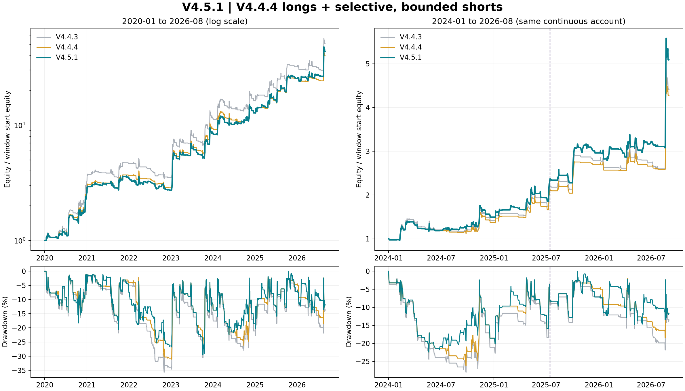
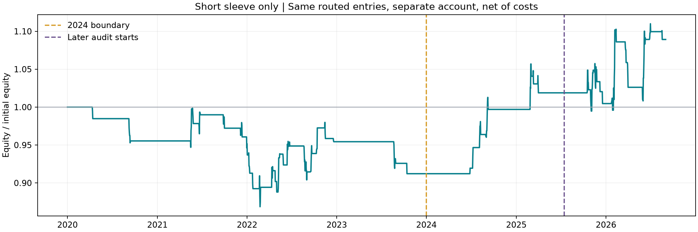

# V4.5.1：V4.4.4 多头 + 选择性趋势空头

**已冻结 `s051`。本轮在历史分钟回测中同时提高了 2024 年后的收益与夏普，并降低了该区间回撤。** 多头信号沿用 V4.4.4；空头只占用多头目标为零的时段。40% Taker 返佣继续保留，有效单边费率为 2.4 bps。

## 主要结果

连续账户从 2020-01-01 以 10,000 USDT 起步，至 2026-09-01 00:00 UTC 前最后一个分钟结束。年界与 2024 边界不重置账户，仅在最终结束平仓。以下收益均已计入模型中的手续费、滑点、冲击和真实资金费。

**重点区间：2024-01 至 2026-08**，从同一连续账户切片：

| 策略 | 累计净收益 | CAGR | 日收益夏普 | 最大回撤 | 周期 / 空头周期 |
|---|---:|---:|---:|---:|---:|
| V4.4.3 | 341.17% | 74.47% | 1.379 | -28.01% | 150 / 0 |
| V4.4.4 | 327.72% | 72.46% | 1.462 | -26.20% | 148 / 0 |
| V4.5.1 | 409.07% | 84.09% | 1.593 | -22.44% | 206 / 57 |

相对 V4.4.4，累计净收益增加 **81.35 个百分点**，夏普增加 **0.131**。相对收益更高但风险较大的 V4.4.3，近期收益与夏普也均提高。

排除 2026 年 8 月，2024-01 至 2026-07：

| 策略 | 累计净收益 | CAGR | 日收益夏普 | 最大回撤 | 周期 / 空头周期 |
|---|---:|---:|---:|---:|---:|
| V4.4.3 | 159.92% | 44.77% | 1.094 | -28.01% | 144 / 0 |
| V4.4.4 | 158.65% | 44.50% | 1.184 | -26.20% | 143 / 0 |
| V4.5.1 | 210.85% | 55.16% | 1.355 | -22.44% | 200 / 56 |

从 2020 年开始的全样本：

| 策略 | 累计净收益 | CAGR | 日收益夏普 | 最大回撤 | 周期 / 空头周期 |
|---|---:|---:|---:|---:|---:|
| V4.4.3 | 4957.51% | 80.13% | 1.503 | -35.69% | 401 / 0 |
| V4.4.4 | 3889.38% | 73.83% | 1.548 | -31.04% | 398 / 0 |
| V4.5.1 | 4229.89% | 75.98% | 1.561 | -29.48% | 521 / 122 |

全样本相对 V4.4.4 也有改善，但夏普增幅很小，累计收益仍低于 V4.4.3。本版的主要收益来自近期，并非所有年份都更好。



图中虚线为 2025-07-15 后段审计起点。统一使用 UTC 日末简单收益、无风险利率为零、√365.25 年化的夏普。最大回撤按每小时权益快照计算；成交和保护触发按实际可用分钟检查。底层 `execution_metrics` 另有小时收益夏普，本文不使用该口径。

## 做空的具体条件

多头仍是 V4.4.4 的 EMA(20/80)、ADX(24/17) 核心与小时级恢复/重夺/突破入场，目标杠杆上限 4 倍。空头采用独立的更快趋势观测，并必须同时满足：

1. **多头目标为零。** 已恢复多头信号时，多头优先，终止空头；不同时持有相反仓位。
2. **长期环境转弱。** 上一根已完成日线收盘低于日线 EMA(90)，该 EMA 相对 5 天前下降。
3. **4h 下跌确认。** EMA(12) < EMA(48)，EMA(48) 相对三根 4h 前下降，−DI > +DI，ADX(14) ≥ 28。
4. **新破位事件。** 本小时收盘低于此前 12 根小时 K 线最低价，最低价窗口排除当前小时。
5. **不追逐过度下跌。** 小时 RSI(14) > 25，4h EMA(12) 距当前收盘不足 2.5 ATR(4h)，短期/长期小时波动率比值 < 2。
6. **空头不拥挤。** 最近已结算资金费率 > −0.02%；不使用未来已公布但尚未结算的资金费。

空头风险与退出：

| 设置 | V4.5.1 |
|---|---|
| 空头目标杠杆上限 | 1.25 倍，低于多头 4 倍 |
| 初始止损 | 入场参考收盘 + 1.25×ATR(20, 4h) |
| 入场风险预算 | 1.5% 权益 ÷ 止损距离百分比 |
| 波动率限制 | 55% ÷ max(168 小时 EWMA 年化波动率, 20%) |
| 最终空头大小 | 上限、止损预算仓位、波动率仓位三者最小值；周期内固定目标杠杆 |
| 止盈 | 入场参考收盘 − 2.5×入场 ATR(4h) |
| 跟踪止损 | 持仓以来最低小时收盘 + 1.75×当前 ATR(4h)，只向盈利方向收紧 |
| 盈利保护 | 有利移动达到 1.5×入场 ATR 后，止损至多为入场参考价 − 0.1×入场 ATR |
| 最长持仓 / 冷却 | 24 小时 / 退出后 6 小时 |
| 额外退出 | 多头恢复、4h EMA(12) ≥ EMA(48)、小时收盘 > 4h EMA(48)、已结算资金费 ≤ −0.04% |

风险预算是按入场参考价和止损距离计算的目标，不是跳空时的亏损保证。触发退出后必须等待冷却结束并出现新的破位事件，不能恢复旧空头周期。信号和新保护价在小时收盘后才可执行；标记价格用于分钟级保护触发。空头没有亏损加倍或逆势摊平规则。

负资金费由空头支付给多头，因此模型计入实际资金费，并设置拥挤限制；方向说明见 [Binance 官方资金费说明](https://www.binance.com/en/academy/glossary/funding-fees)。这不是依赖固定资金费收益的套利策略。

配置：[v4_5_1_params.json](../../configs/v4_5_1_params.json)；实现：[v451.py](../../src/btc_regime/v451.py)。`V451Params()` 与冻结空头参数一致；`short_enabled=False` 的信号严格等于 V4.4.4。

## 选参与后段审计

先登记 [protocol.json](protocol.json)，限定 72 组组合：4h 趋势/日线短期转弱/长期转弱三种门槛，12h/24h 破位或反弹失败三种入场，两组保护期限，ADX 20/28，两组空头风险预算。未改动 V4.4.4 多头模块。

空头搜索只使用 **2025-07-01 之前**的数据。评分由 20% 的 2020–2023 效用、40% 的 2024 效用、40% 的 2025-01-15 至 2025-06-30 效用组成；效用 = 夏普 + 0.5×年化对数增长 + 最大回撤（负数），另减 0.2×近期三个半年度夏普标准差。近期权重合计 80%。资格要求近期总收益和夏普均高于基线、2024 与 2025 上半年空头周期收益和均为正、分别至少 5/3 个空头周期、旧段夏普最多下降 0.15，全样本/近期回撤不超过 40%/35%。

代理回测有 7 组符合资格，按评分取 6 组做完整分钟复核。以下“空头收益和”为各空头周期的净盈亏/入场权益之和，**不是组合累计收益**：

| 候选 | 2024 至 2025H1 收益 | 同期夏普 | 2024 空头收益和 | 2025H1 验证空头收益和 | 评分 |
|---|---:|---:|---:|---:|---:|
| V444 | 73.59% | 1.108 | 0.00% | 0.00% | 1.114 |
| s051 | 93.79% | 1.284 | 9.00% | 2.23% | 1.269 |
| s050 | 86.92% | 1.229 | 6.01% | 1.49% | 1.235 |
| s067 | 88.40% | 1.231 | 5.11% | 3.51% | 1.231 |
| s066 | 83.54% | 1.195 | 3.42% | 2.34% | 1.207 |
| s055 | 83.00% | 1.190 | 3.15% | 2.30% | 1.190 |
| s054 | 79.91% | 1.165 | 2.10% | 1.53% | 1.169 |

据此锁定 `s051`，之后才评估本轮未用于空头选择的后段，不再修改参数。开发期 2024 年只有 10 个、2025 上半年验证期只有 6 个入选空头周期，样本仍小；更多成交并不等于更多独立市场环境。

**2025-07-15 至 2026-08-31 独立以 10,000 USDT 起步**的后段账户：

| 策略 | 累计净收益 | CAGR | 日收益夏普 | 最大回撤 | 周期 / 空头周期 |
|---|---:|---:|---:|---:|---:|
| V4.4.4 | 103.59% | 87.52% | 1.617 | -18.16% | 55 / 0 |
| V4.5.1 | 117.60% | 98.89% | 1.714 | -14.58% | 96 / 41 |

这是一项程序化后段检验，不能称为完全盲样本外：V4.4 系列此前已经使用了截至 2026 年 8 月的数据，多头基线本身也由这些数据选出；候选设计是事后研究。14 天间隔用于隔开选择结束和后段起点，后段重置账户，但指标保留此前历史暖机。全账户切片和独立账户结果因持仓、资金规模、数量取整与冲击路径不同，分别保存，不交叉比较。

## 空头贡献与薄弱年份

| 年度 | V4.4.4 收益 | V4.5.1 收益 | V4.4.4 夏普 | V4.5.1 夏普 | 空头周期 | 空头周期收益和 |
|---|---:|---:|---:|---:|---:|---:|
| 2020 | 170.10% | 158.09% | 2.321 | 2.221 | 4 | -4.53% |
| 2021 | 35.30% | 34.77% | 1.287 | 1.245 | 18 | -0.81% |
| 2022 | -21.83% | -21.64% | -1.302 | -1.094 | 37 | 1.29% |
| 2023 | 226.50% | 212.07% | 2.476 | 2.387 | 6 | -4.53% |
| 2024 | 36.92% | 49.64% | 0.964 | 1.178 | 10 | 9.00% |
| 2025 | 96.76% | 97.86% | 1.970 | 1.945 | 23 | 0.92% |
| 2026（1–8月） | 58.76% | 71.93% | 1.539 | 1.736 | 24 | 8.38% |

2024 和 2026 年的改善较明显，2025 年收益略升而夏普略降。2020–2023 的空头总体贡献为负；2022 年也没有变成盈利年。这套空头适合补充部分下跌段，尚不具备跨所有历史环境的稳定空头优势。

为了核对贡献，保留组合实际允许的空头信号、移除多头，在独立账户运行：

| 策略 | 累计净收益 | CAGR | 日收益夏普 | 最大回撤 | 周期 / 空头周期 |
|---|---:|---:|---:|---:|---:|
| 2020–2023 | -8.78% | -2.27% | -0.341 | -14.01% | 65 / 65 |
| 2024–2026年8月 | 19.41% | 6.88% | 0.852 | -9.30% | 57 / 57 |
| 2025-07-15 后段 | 6.91% | 6.09% | 0.602 | -9.30% | 41 / 41 |

该空头账户的收益不能直接与多头收益相加，因为组合复利、资金规模和交易成本路径不同。关闭空头的对照则与 V4.4.4 相同，证明本版增量来自空头模块及相应账户路径。



## 成本、延迟与不确定性

所有压力场景均对两版施加相同假设，箭头为 V4.4.4 → V4.5.1：

| 场景 | 2024 年后收益 | 2024 年后夏普 | 2024 年后截至 7 月夏普 | 全样本夏普 |
|---|---:|---:|---:|---:|
| 成本冲击 | 235.20% → 283.21% | 1.253 → 1.354 | 0.942 → 1.078 | 1.344 → 1.332 |
| 无返佣 | 296.65% → 365.82% | 1.398 → 1.519 | 1.109 → 1.268 | 1.484 → 1.488 |
| 延迟一小时 | 250.92% → 330.39% | 1.316 → 1.479 | 1.021 → 1.234 | 1.392 → 1.392 |

三种压力下，2024 年后收益与夏普仍高于 V4.4.4，排除 2026 年 8 月后也成立。但全样本成本冲击场景的夏普由 1.344 降为 1.332，延迟场景几乎持平，说明更早历史中的薄弱空头会消耗交易成本，全样本优势不稳固。

成本冲击采用净 Taker 4.8 bps、基础滑点 3 bps、冲击系数 16 bps；无返佣采用 Taker 4 bps；延迟场景把信号和保护价更新一起后移一小时。基础场景为净 Taker 2.4 bps、基础滑点 1 bps、冲击系数 8 bps。40% 返佣仅作用于 Taker 手续费，不降低资金费、滑点或强平费；按成交时净额记账，未建模返佣到账延迟。

14 天配对区块 bootstrap（2,000 次），V4.5.1 减 V4.4.4 的夏普差 95% 区间：

| 样本 | 夏普差 95% 区间 |
|---|---:|
| 全样本 | [-0.1097, 0.1542] |
| 2024 年后 | [-0.0934, 0.4294] |
| 2024 年后截至 7 月 | [-0.0975, 0.4933] |
| 2025-07-15 后段 | [-0.3998, 0.9004] |

以上四个夏普差区间均包含零。这是选参后的条件不确定性估计，未做多重试验校正，也不能消除旧版选参对后段的影响。历史结果满足本轮重点目标，但统计优势尚未确认，未来表现仍需新的时间样本检验。

## 数据、执行与复现

使用 2020-01-01 至 2026-08-31 的 BTCUSDT U 本位永续成交价、标记价和真实资金费。理论 3,506,400 分钟，实际配对 3,506,345 分钟，缺少 55 分钟；无前向填充或未来值补齐。缺口内无法完整检查止损，详见 [data_audit.json](data_audit.json)。2026 年 9 月未纳入。

普通单限制 2%/分钟参与率、0.001 BTC 步长和 5 USDT 最小名义额；保护单单独计入冲击和跳空。维持保证金分档等采用项目固定模型假设，不是历史交易所档位快照。全样本 V4.5.1 模拟成交 2016 笔、完整周期 521 个、强平 0 次，最终权益 432,989.27 USDT。

参数及源码、实际缓存 SHA-256 位于 [selection_lock.json](selection_lock.json)。完整净值、成交、周期、资金费和强平记录在 `continuous/s051__base/`，压力场景在 `stress/`，后段独立账户在 `holdout_reset/`。汇总：[report.json](report.json)；验收：[acceptance.json](acceptance.json)。

安装项目依赖（绘图需 matplotlib）后，在仓库根目录使用已有缓存复现：

```bash
PYTHONPATH=src:scripts python3 scripts/full_backtest_v451.py
PYTHONPATH=src:scripts python3 scripts/evaluate_v451.py audit --workers 3
PYTHONPATH=src:scripts python3 scripts/evaluate_v451.py stress --workers 3
PYTHONPATH=src:scripts python3 scripts/render_v451_report.py
PYTHONPATH=src python3 -m pytest -q
```

开发阶段脚本为 `scripts/research_v451.py screen/minute`，冻结后拒绝重新选择。代码验证：90 项测试通过，包括前缀因果性、多头优先、空头上限、止损只收紧、标记价触发、冷却、资金费过滤及关闭空头对照；本轮 Python 文件通过 Ruff。V4.5.1 为冻结研究候选，未改变项目默认策略。
