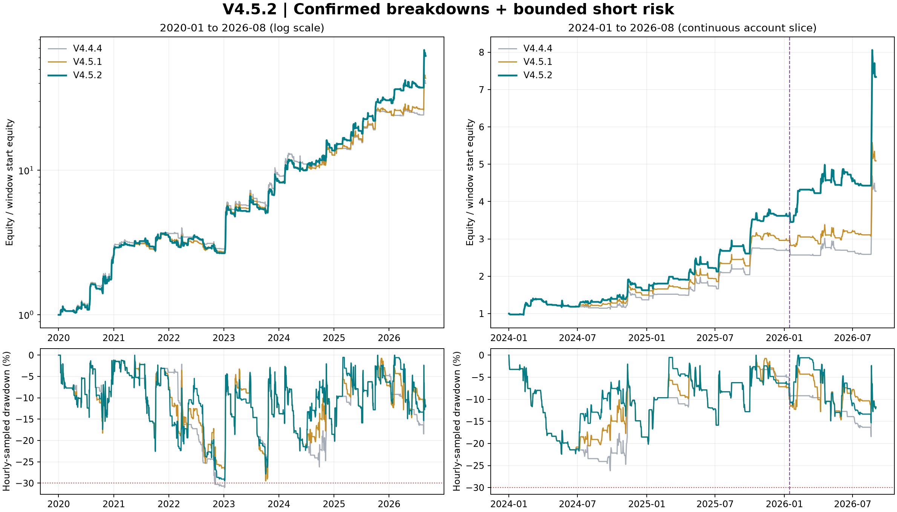
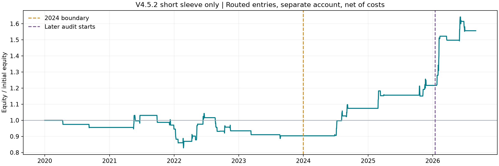

# V4.5.2：更严格的破位空头与更高风险预算

**已冻结 `b022`，满足本轮历史回测目标：提高 2024 年后的收益与夏普，分钟收盘权益最大回撤低于 30%。** 保留 V4.4.4 多头、40% Taker 返佣；空头目标杠杆上限由 1.25 倍提高到 2 倍，同时收紧趋势强度、成交额和资金费过滤。

## 主要结果

账户从 2020-01-01 以 10,000 USDT 起步，至 2026-09-01 00:00 UTC 结束，覆盖截至 2026 年 8 月的完整数据。年界不重置账户，只在最终结束强制平仓。收益计入手续费、滑点、冲击和真实资金费。

**重点区间：2024-01 至 2026-08，同一连续账户切片：**

| 策略 | 累计净收益 | CAGR | 日收益夏普 | 小时权益最大回撤 | 周期 / 空头周期 |
|---|---:|---:|---:|---:|---:|
| V4.4.4 | 327.72% | 72.46% | 1.462 | 26.20% | 148 / 0 |
| V4.5.1 | 409.07% | 84.09% | 1.593 | 22.44% | 206 / 57 |
| V4.5.2 | 633.76% | 111.15% | 1.872 | 22.44% | 192 / 41 |

相对 V4.5.1，累计净收益增加 **224.69 个百分点**，日收益夏普增加 **0.279**。小时权益回撤约 22.44%，但更细的分钟权益显示回撤 **26.53%**，这是本轮判断是否满足 30% 要求的口径。

排除 2026 年 8 月，2024-01 至 2026-07：

| 策略 | 累计净收益 | CAGR | 日收益夏普 | 小时权益最大回撤 | 周期 / 空头周期 |
|---|---:|---:|---:|---:|---:|
| V4.4.4 | 158.65% | 44.50% | 1.184 | 26.20% | 143 / 0 |
| V4.5.1 | 210.85% | 55.16% | 1.355 | 22.44% | 200 / 56 |
| V4.5.2 | 342.72% | 77.94% | 1.682 | 22.44% | 186 / 41 |

从 2020 年开始的全样本：

| 策略 | 累计净收益 | CAGR | 日收益夏普 | 小时权益最大回撤 | 周期 / 空头周期 |
|---|---:|---:|---:|---:|---:|
| V4.4.4 | 3889.38% | 73.83% | 1.548 | 31.04% | 398 / 0 |
| V4.5.1 | 4229.89% | 75.98% | 1.561 | 29.48% | 521 / 122 |
| V4.5.2 | 6080.63% | 85.63% | 1.665 | 29.40% | 501 / 98 |



图中虚线为本轮 2026-01-15 后段审计起点；图中回撤来自小时权益。夏普统一使用 UTC 日末简单收益、无风险利率为零、√365.25 年化；底层 `execution_metrics` 的小时收益夏普不用于正文比较。

## 分钟权益回撤核查

额外重跑两个连续账户，逐分钟保存权益用于计算最大回撤，不改变交易规则。结果如下：

| 策略 | 全样本分钟回撤 | 2024 年后分钟回撤 | 2026-01-15 后段分钟回撤 |
|---|---:|---:|---:|
| V4.5.1 | 30.46% | 26.29% | 17.45% |
| V4.5.2 | 29.48% | 26.53% | 17.56% |

V4.5.2 的近期分钟回撤略高于 V4.5.1，仍低于本轮上限；不能把小时快照的 22.44% 当作分钟回撤。30% 是本轮已实现历史路径的验收条件，代码没有保证未来回撤绝不超过 30% 的账户熔断。分钟收盘权益也不等于分钟内部最差瞬时权益；保护与强平按分钟标记高低价检查，实际跳空和流动性不足仍可能扩大亏损。

分钟审计指标保存于 `drawdown/*/report.json`；其 `equity.csv` 为便于存储仍下采样至小时，不能直接从该 CSV 还原分钟回撤，需运行 `evaluate_v452.py drawdown` 重新计算。

## 本版的具体修改

| 空头设置 | V4.5.1 | V4.5.2 |
|---|---|---|
| 目标杠杆上限 | 1.25 倍 | **2 倍** |
| 止损距离对应的入场风险预算 | 权益 1.5% | **权益 2.5%** |
| 年化波动率目标 | 55% | **90%** |
| 4h ADX(14) 下限 | 28 | **32** |
| 新破位窗口 | 前 12 小时低点 | **前 8 小时低点** |
| 成交额确认 | 无 | **完成小时成交额 ≥ 前 24 小时成交额中位数的 1.1 倍** |
| 最近已结算资金费入场下限 | > −0.02% | **> −0.01%** |
| 退出后的冷却 | 6 小时 | **3 小时** |

最终空头目标杠杆 = min(2, 0.025 / 初始止损距离百分比, 0.90 / max(168 小时 EWMA 年化波动率, 0.20))。2024 年后信号入场目标杠杆均值由 **0.742 倍提高至 1.179 倍**；这是每个空头周期首个信号的均值，不是实际成交加权杠杆或盘中峰值。风险预算是基于参考价与 ATR 的计划值，不是单笔实际亏损保证。

其他条件继续保留：

1. 多头目标为零才允许做空；多头恢复优先。多头沿用冻结的 V4.4.4，目标上限 4 倍。
2. 最近已完成日线收盘低于 EMA(90)，且该 EMA 相对 5 天前下降。
3. 4h EMA(12) < EMA(48)，EMA(48) 相对三根 4h 前下降，−DI > +DI。
4. 小时 RSI(14) > 25；EMA(12, 4h) 距当前收盘 < 2.5 ATR(20, 4h)；短长小时波动率比值 < 2，防止过度追空。
5. 初始止损为入场参考收盘 + 1.25 ATR，止盈为参考收盘 − 2.5 ATR；最低小时收盘 + 1.75 当前 ATR 构成只收紧的跟踪止损。
6. 盈利达到 1.5 入场 ATR 后，止损至多为入场参考价 − 0.1 入场 ATR；最长持仓 24 小时。
7. 多头恢复、快慢均线反转、收盘高于慢均线、已结算资金费 ≤ −0.04%，或触发保护时退出。退出后等待冷却和新的入场事件。

所有指标使用已完成 K 线，前低窗口和成交额比较窗口排除当前小时；资金费只读取已结算事件。小时信号最早在下一小时开盘执行，标记价格触发分钟保护。空头周期内目标杠杆固定，不采用亏损加倍规则。

缩短窗口与冷却给策略更多重新入场机会，但最终过滤更严格，**2024 年后空头周期从 57 降至 41，全部周期从 206 降至 192**。本轮优势来自更有效的信号与较高风险预算，没有以交易数增加来代替独立样本。全样本成交笔数由 2,016 增至 2,124，包含分批成交，不能当作独立交易样本。

配置：[v4_5_2_params.json](../../configs/v4_5_2_params.json)；实现：[v452.py](../../src/btc_regime/v452.py)。`V452Params()` 与冻结参数一致，关闭空头返回 V4.4.4 信号。

## 选择过程与样本划分

按 [protocol.json](protocol.json) 先做 72 组信号组合：长期下跌/混合战术下跌两类环境，8h/12h/24h 破位或破位加均线拒绝四类入场，基础/方向强度/成交额与资金费三类确认，ADX 24/28/32。第一阶段维持 V4.5.1 的仓位和保护，避免把加杠杆误认为信号改进。

保留原 V4.5.1 信号和评分靠前的三组不同信号，在第二阶段评估三组保护、三组风险预算、3h/6h 冷却，共 72 次参数组合回测。跨阶段有重复组合，不把 144 次尝试称为 144 个独立假设。前八个合格组合再做连续分钟复核，同时运行基线和两个仅提高风险预算的对照。对照不参与最终候选选择。

开发数据仅截至 **2025-12-31**：2020–2023 权重 15%，2024 权重 35%，2025-01-15 至年底验证段权重 50%。效用 = 夏普 + 0.65×年化对数增长 + 0.5×最大回撤（负数），再减去近期四个半年夏普标准差的 0.2 倍。近期权重合计 85%。必须同时满足近期收益、夏普高于 V4.5.1，近期回撤 ≤30%，全样本回撤 ≤45%，旧段夏普退化不超过 0.20，2024/2025 验证段各至少 5 个空头周期且净收益和为正。

以下为全部分钟候选与固定对照；“空头收益和”是每笔净盈亏/入场权益之和，不是组合累计收益：

| 编号 | 用途 | 2024–2025 收益 | 同期夏普 | 2024 空头收益和 | 2025 验证空头收益和 | 加权评分 |
|---|---|---:|---:|---:|---:|---:|
| V451 | 对照 | 196.09% | 1.551 | 9.00% | 0.92% | 1.706 |
| b022 | 候选 | 261.85% | 1.779 | 17.71% | 13.04% | 1.954 |
| b023 | 候选 | 255.84% | 1.759 | 17.36% | 11.70% | 1.928 |
| b058 | 候选 | 241.20% | 1.716 | 7.54% | 17.00% | 1.908 |
| b041 | 候选 | 238.65% | 1.707 | 7.72% | 16.06% | 1.898 |
| b020 | 候选 | 241.78% | 1.724 | 14.18% | 10.42% | 1.898 |
| b040 | 候选 | 237.79% | 1.704 | 7.72% | 15.82% | 1.895 |
| b021 | 候选 | 237.25% | 1.707 | 13.90% | 9.36% | 1.877 |
| b059 | 候选 | 233.39% | 1.686 | 7.54% | 14.70% | 1.877 |
| risk_elevated | 对照 | 204.88% | 1.575 | 11.99% | 1.23% | 1.725 |
| risk_higher | 对照 | 213.45% | 1.592 | 14.98% | 1.52% | 1.739 |

`b022` 的开发期空头只有 2024 年 10 个、2025 验证段 14 个。它凭开发期分钟评分胜出后冻结，之后没有根据 2026 年审计切换候选或修改参数。

**2026-01-15 至 2026-08-31 独立以 10,000 USDT 起步的后段账户：**

| 策略 | 累计净收益 | CAGR | 日收益夏普 | 小时权益最大回撤 | 周期 / 空头周期 |
|---|---:|---:|---:|---:|---:|
| V4.5.1 | 69.42% | 131.83% | 1.760 | 14.57% | 58 / 24 |
| V4.5.2 | 99.75% | 201.49% | 2.188 | 14.97% | 52 / 17 |

后段收益与夏普继续改善，回撤略升。14 天间隔用于隔开本轮选择结束与后段开始，指标仍使用此前历史暖机。连续账户切片与重置账户因持仓、资金规模、冲击、数量取整不同，不混用指标。

**这不是完全盲样本外。** 本轮把旧版的 2025 年下半年后段纳入开发，2026 年仅不参与本轮的新选择；但 V4.4/V4.5.1 已查看过截至 2026 年 8 月的数据，多头基线和候选设计也受这些历史结果影响。验证段参与评分，属于模型选择的一部分，真正独立的新时间样本仍需后续积累。

## 收益来自信号还是加杠杆

以下固定其他条件，仅替换一组设置，比较 2024 年后同一连续账户区间：

| 策略 | 累计净收益 | CAGR | 日收益夏普 | 小时权益最大回撤 | 周期 / 空头周期 |
|---|---:|---:|---:|---:|---:|
| V4.5.1 | 409.07% | 84.09% | 1.593 | 22.44% | 206 / 57 |
| 仅提高空头风险预算 | 464.95% | 91.43% | 1.645 | 22.43% | 207 / 57 |
| 仅优化空头信号与冷却 | 494.81% | 95.16% | 1.729 | 22.44% | 186 / 41 |
| V4.5.2 完整版 | 633.76% | 111.15% | 1.872 | 22.44% | 192 / 41 |

仅增加风险预算的改善弱于优化信号；二者结合产生本版最好结果。仓位与信号有交互、复利和成本路径不同，收益差不能相加解释。

| 年度 | V4.5.1 收益 | V4.5.2 收益 | V4.5.1 夏普 | V4.5.2 夏普 | V4.5.2 空头周期 | 空头周期收益和 |
|---|---:|---:|---:|---:|---:|---:|
| 2020 | 158.09% | 158.15% | 2.221 | 2.220 | 3 | -4.49% |
| 2021 | 34.77% | 33.87% | 1.245 | 1.178 | 17 | -0.51% |
| 2022 | -21.64% | -22.80% | -1.094 | -0.975 | 33 | -0.07% |
| 2023 | 212.07% | 215.69% | 2.387 | 2.407 | 4 | -3.35% |
| 2024 | 49.64% | 62.61% | 1.178 | 1.365 | 10 | 17.71% |
| 2025 | 97.86% | 122.53% | 1.945 | 2.217 | 14 | 13.04% |
| 2026（1–8月） | 71.93% | 102.78% | 1.736 | 2.139 | 17 | 25.57% |

2024、2025、2026 年收益和夏普均改善。2020–2023 的组合夏普由 1.541 降至 1.515；2022 年组合仍亏损且收益更差。高风险空头没有在所有历史环境中获得稳定优势。

保留实际被多头路由允许的空头信号、移除多头，在独立账户运行：

| 策略 | 累计净收益 | CAGR | 日收益夏普 | 小时权益最大回撤 | 周期 / 空头周期 |
|---|---:|---:|---:|---:|---:|
| 2020–2023 | -9.63% | -2.50% | -0.215 | 21.18% | 57 / 57 |
| 2024–2026年8月 | 72.24% | 22.62% | 1.704 | 6.07% | 41 / 41 |
| 2026-01-15 后段 | 27.91% | 48.08% | 2.283 | 5.83% | 17 / 17 |



空头独立账户早期亏损、近期盈利；其收益不能直接加到多头收益上。该诊断也包含多头优先的路由筛选，并不是不受限制的独立做空系统。

## 成本、延迟和统计不确定性

两版使用相同压力假设，箭头为 V4.5.1 → V4.5.2：

| 场景 | 2024 年后净收益 | 2024 年后夏普 | V4.5.2 近期小时回撤 | 全样本夏普 |
|---|---:|---:|---:|---:|
| 成本冲击 | 283.21% → 447.86% | 1.354 → 1.635 | 25.10% | 1.332 → 1.435 |
| 无返佣 | 365.82% → 568.96% | 1.519 → 1.798 | 23.25% | 1.488 → 1.592 |
| 延迟一小时 | 330.39% → 555.73% | 1.479 → 1.818 | 23.90% | 1.392 → 1.498 |

三种压力下近期收益与夏普仍高于 V4.5.1，排除 8 月后也成立。全样本压力下夏普同样改善，但 V4.5.2 的全样本小时回撤在成本冲击下为 34.84%、延迟下为 38.17%，高于 V4.5.1；放大空头风险预算的早期历史代价仍然存在。压力场景的回撤仅按小时快照检查，不将它们当作已通过分钟 30% 上限的证据。

基础净 Taker 费为 4 bps×(1−40%) = **2.4 bps/边**，基础滑点 1 bps，冲击项为 8 bps×√参与率。成本冲击为净 Taker 4.8 bps、基础滑点 3 bps、冲击系数 16 bps；无返佣为 Taker 4 bps；延迟为信号和保护更新一并延后 1 小时。返佣仅作用于 Taker 费，按成交时净额记账，不降低资金费、滑点或强平费，未模拟到账延迟。

14 天配对区块 bootstrap（2,000 次），V4.5.2 减 V4.5.1 的日收益夏普差 95% 区间：

| 样本 | 夏普差 95% 区间 |
|---|---:|
| 全样本 | [-0.0175, 0.2425] |
| 2024 年后 | [0.0625, 0.6097] |
| 2024 年后截至 7 月 | [0.0612, 0.6557] |
| 2026-01-15 后段连续账户切片 | [-0.1891, 1.6724] |

这些区间是选参后的条件估计，未校正多重尝试，也未覆盖参数搜索和旧版开发的偏差；即使部分区间高于零，也不能据此宣布未来优势得到确认。41 个近期空头周期与更少的市场状态仍限制统计可信度。

## 数据、执行与复现

使用项目已有 Binance BTCUSDT U 本位永续成交价、标记价和真实资金费缓存。理论 3,506,400 分钟，实际配对 3,506,345 分钟，缺 55 分钟，不填补缺口；缺口内不能完整检查保护。2026 年 9 月未纳入。详见 [data_audit.json](data_audit.json)。

普通单最多占分钟名义成交额 2%，数量步长 0.001 BTC，最小名义额 5 USDT；保护单单独处理跳空和冲击。维持保证金档位是项目固定假设，不是历史档位快照。完整样本 V4.5.2 为 501 个周期、2124 笔成交、0 次模型强平，最终权益 618,062.60 USDT。

参数、源代码和实际缓存 SHA-256 见 [selection_lock.json](selection_lock.json)。原始交易、净值、成交、资金费、强平记录在 `continuous/b022__base/`；归因在 `attribution/`，压力在 `stress/`，分钟回撤在 `drawdown/`，后段重置账户在 `holdout_reset/`。汇总：[report.json](report.json)；验收：[acceptance.json](acceptance.json)。

安装项目依赖后，在仓库根目录使用现有缓存复现：

```bash
PYTHONPATH=src:scripts python3 scripts/full_backtest_v452.py
PYTHONPATH=src:scripts python3 scripts/evaluate_v452.py audit --workers 3
PYTHONPATH=src:scripts python3 scripts/evaluate_v452.py stress --workers 3
PYTHONPATH=src:scripts python3 scripts/evaluate_v452.py drawdown --workers 2
PYTHONPATH=src:scripts python3 scripts/render_v452_report.py
PYTHONPATH=src python3 -m pytest -q
```

开发过程为 `research_v452.py signals/refine/minute`；冻结后拒绝重新选择。96 项测试通过，包括 V4.5.1 严格对照、时间前缀因果性、多头优先、杠杆约束、止损只收紧、风险预算只影响仓位、候选格点验证，以及已有分钟执行测试。V4.5.2 保持冻结研究候选状态，未修改项目默认策略。
